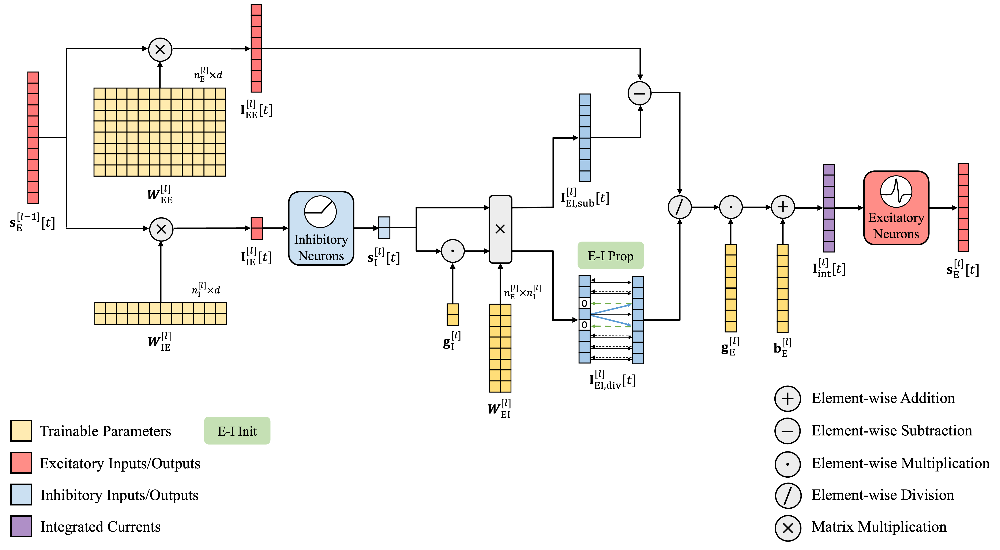

# DeepEISNN

[](https://openreview.net/forum?id=U8preGvn5G)
[](https://huggingface.co/vwOvOwv/DeepEISNN)

Code for paper [Training Deep Normalization-Free Spiking Neural Networks with
Lateral Inhibition](https://openreview.net/pdf?id=U8preGvn5G).



## Table of Contents

- [🚀 Quick Start](#-quick-start)
  - [Environment setup](#environment-setup)
  - [Train from scratch](#train-from-scratch)
  - [Resume from checkpoints](#resume-from-checkpoints)
- [🎓 Learn More about E-I Interaction](#-learn-more-about-e-i-interaction)
  - [Code structure](#code-structure)
  - [Usage](#usage)
  - [Visualization](#visualization)
- [Checkpoints](#checkpoints)
  - [Evaluation](#evaluation)
  - [Model cards](#model-cards)
- [Citation](#citation)
- [Contact](#contact)

## 🚀 Quick Start

### Environment setup

All experiments are conducted with

- Python 3.12.10
- NVIDIA GeForce RTX 4090 GPU
- CUDA 12.6
- PyTorch 2.4.1

Create the conda environment with the following command:

```bash
conda env create -f environment.yml
conda activate deepeisnn
```

### Train from scratch

We provide all training configurations in `configs/EI-SNN`.

Simply run the following command to reproduce the results on CIFAR-10 with
ResNet-18 in the paper.

```bash
python train.py --scratch configs/EI-SNN/CIFAR10-ResNet18.yaml
```

Please modify `data_path` and `output_dir` in the configuration file before
training.

Other configuration files are also named in the format of
`[Dataset]-[Arch].yaml`. See `configs/EI-SNN` and `configs/BN-SNN` for more
examples.

### Resume from checkpoints

To resume training from checkpoints, run the following command:

```bash
python train.py --resume [Checkpoint-Path]
```

## 🎓 Learn More about E-I Interaction

Below is detailed information about this repo, which may help further research on E-I dynamics based on our work.

### Code structure

```text
DeepEISNN/
├── configs/            # YAML configs for EI-SNN and BN-SNN
│   ├── EI-SNN/         # EI-SNN experiment configs
│   └── BN-SNN/         # BN-SNN experiment configs
├── datasets/           # dataset loaders and preprocessing
├── models/             # MLP/VGG/ResNet architectures
├── modules/            # layers, normalizations, and optimizers
├── utils/              # metrics, visualization, etc.
└── train.py            # training script
```

To keep consistent with standard `Conv/Linear-Norm-Activation` structure, we split 
the E-I layer into `EiConv/EiLinear-EiNorm-Activation`:

- `modules/linear.py`: `SpikingEiLinear` implements E-I linear layers with separate E-to-E and E-to-I pathways, the dynamic initialization, and non-negative clamping.
- `modules/conv2d.py`: `SpikingEiConv2d` is the convolutional counterpart to `SpikingEiLinear`.
- `modules/norm1d.py` and `modules/norm2d.py`: `SpikingEiNorm1d/2d` integrate E-I currents via E-I balance and gain control.

We also implement an SGD optimizer for E-I models:

- `modules/optimizers.py`: `EiSGD` is an SGD variant with optional non-negative clamping for E-I constraints.

### Usage

Key arguments in `train.py`:

- `--scratch <config.yaml>`: train from scratch
- `--resume <ckpt.pth>`: resume training
- `--log {0,1,2}`: logging level
- `--notes <str>`: add notes about experiment
- `--seed <int>`: random seed (default 2025)

To build E-I models, you can either use the provided E-I configs or use the E-I modules in your own model definition. The E-I modules follow the `Conv/Linear-Norm-Activation` convention, but require extra arguments and pass E-I currents between modules:

- `Conv2d` -> `SpikingEiConv2d(in_channels, out_channels, ei_ratio, device, rng, ...)`
- `Linear` -> `SpikingEiLinear(in_features, out_features, ei_ratio, device, rng, ...)`
- `BatchNorm2d` -> `SpikingEiNorm2d(num_features, prev_in_features, ei_ratio, device)`
- `BatchNorm1d` -> `SpikingEiNorm1d(num_features, prev_in_features, ei_ratio, device, output_layer)` (set `output_layer=True` for the final norm)

Here, `prev_in_features` is the fan-in ($d$ in the paper) of the `SpikingEiConv2d/Linear` layer. 

When constructing your own model, keep the E-I module sequence as `EiConv/EiLinear-EiNorm-Activation`. Note that `EiNorm` does not collect statistics to perform explicit normalization during training.

### Visualization

We provide visualization demonstrating evolving distributions of 

- all trainable parameters
- inputs/outputs of all layers

during training.

Simply add `--log 2` in the shell command to enable visualization. For example:

```bash
python train.py --scratch configs/EI-SNN/[Dataset]-[Arch].yaml --log 2
```

👀 See how bimodality emerges during training!


## Checkpoints

All pretrained checkpoints are available on [Hugging Face](https://huggingface.co/vwOvOwv/DeepEISNN).


### Evaluation

Use the following command to quickly evaluate the pretrained checkpoints on the evaluation set.

```bash
python eval_pretrained.py --model [Dataset]-[Arch] --data_path [Dataset-Path]
```

The script will automatically download the corresponding weights from Hugging Face.

### Model cards

| Dataset | Arch | T | Top-1 Acc(%) | Model Name|
|:---:|:---:|:---:|:---:|:---:|
| CIFAR-10 | ResNet-18 | 4 | 92.06 | CIFAR10-ResNet18 |
| CIFAR-10 | VGG-8 | 4 | 87.03 | CIFAR10-VGG8 |
| CIFAR-10 | VGG-11 | 4 | 88.43 | CIFAR10-VGG11 |
| CIFAR-10 | VGG-16 | 4 | 91.01 | CIFAR10-VGG16 |
| CIFAR-10 | VGG-19 | 4 | 91.36 | CIFAR10-VGG19 |
| CIFAR-100 | VGG-16 | 4 | 65.90 | CIFAR100-VGG16 |
| CIFAR-100 | VGG-19 | 4 | 64.06 | CIFAR100-VGG19 |
| CIFAR10-DVS | VGG-8 | 10 | 78.40 | CIFAR10DVS-VGG8 |
| CIFAR10-DVS | VGG-11 | 10 | 78.40 | CIFAR10DVS-VGG11 |
| DVS-Gesture | VGG-8 | 16 | 95.83 | DVSGesture-VGG8 |
| TinyImageNet200 | ResNet-18 | 4 | 50.29 | TinyImageNet200-ResNet18 |

## Citation

If this work is helpful, please kindly cite as:

```bibtex
@inproceedings{
  liu2026training,
  title={Training Deep Normalization-Free Spiking Neural Networks with Lateral Inhibition},
  author={Peiyu Liu and Jianhao Ding and Zhaofei Yu},
  booktitle={The Fourteenth International Conference on Learning Representations},
  year={2026},
  url={https://openreview.net/forum?id=U8preGvn5G}
}
```

## Contact

If you have any questions, please feel free to contact me via
[email](mailto:512120lpy@stu.pku.edu.cn) or raise an issue.
